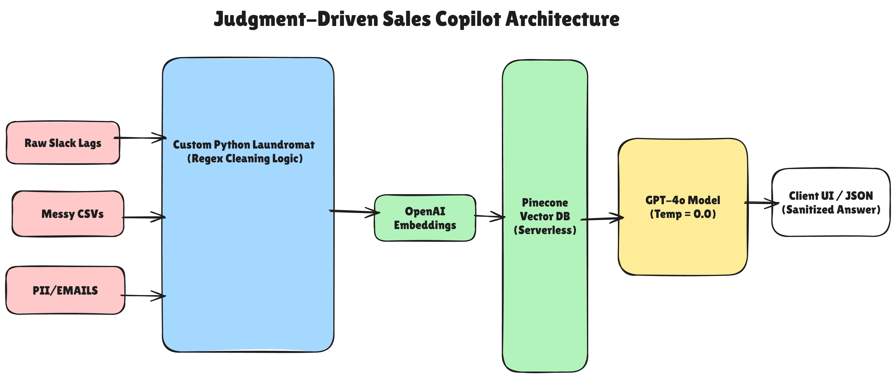

Judgment-Driven Sales Copilot (Deterministic RAG)

A Glass Box AI architecture designed to eliminate hallucinations and enforce data hygiene in high-ticket enterprise sales environments.

The Architecture

(Refer to the full architecture diagram above for the Red-to-Green data flow)

The Business Problem
In high-stakes sales environments, generic AI wrappers (using Black Box frameworks) pose two critical risks:
1.  Hallucinations: Inventing discounts or features that do not exist.
2.  Data Leaks: Ingesting PII (Personally Identifiable Information) directly into Vector Databases without sanitization.

The Solution: Glass Box RAG
This project implements a strictly deterministic Retrieval-Augmented Generation (RAG) system. Unlike standard implementations that rely on abstracted frameworks (like LangChain or LlamaIndex), this system uses raw Python logic to ensure atomic control over every step of the data lifecycle.

Key Features

1. The Laundromat Ingestion Layer (Regex)
Before any data is embedded, it passes through a custom sanitization pipeline.
Method: strictly defined Regex patterns.
Function: Surgically removes PII, User IDs, and non-semantic noise (headers/footers) before the data touches the Vector DB.
Result: 100% GDPR-compliant vectors and reduced token costs.

2. No-Framework Architecture
Why: Frameworks introduce dependency bloat and magic logic that is hard to debug in production.
Implementation: Direct API calls to OpenAI and Pinecone allow for precise error handling and latency optimization.

3. Deterministic Inference
Model: GPT-4o.
Temperature: Set strictly to `0`.
System Prompting: Enforces a "Refusal Protocol, If the answer is not in the retrieved context, the model is instructed to reply: I cannot find that information in the approved knowledge base.

Tech Stack

Core Logic: Python 3.10+
LLM: OpenAI GPT-4o (API)
Vector Database: Pinecone (Serverless)
Embeddings: OpenAI text-embedding-3-small.
Data Cleaning: Python (Regular Expressions)
Environment: python-dotenv for key management

Setup & Installation

 Prerequisites
 Python 3.10 or higher
API Keys for OpenAI and Pinecone
